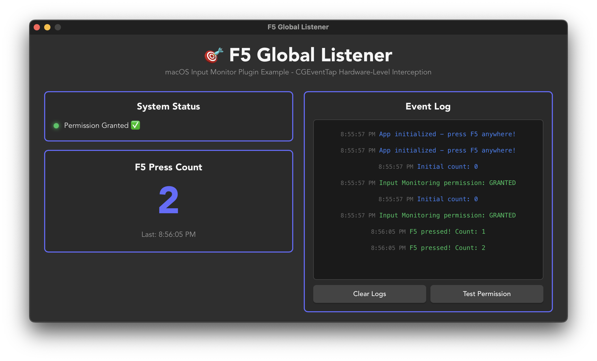

# F5 Override Example

This example demonstrates how to use `tauri-plugin-macos-input-monitor` to override the **F5 dictation shortcut** on macOS.



## Why F5?

**The Problem:** On macOS, pressing F5 triggers the system dictation popup ("Enable Dictation?"). This is a common frustration for developers who want to use F5 for custom app shortcuts (refresh, debug, game controls, etc.).

**Standard solutions don't work:**
- `tauri-plugin-global-shortcut` can't override it (application-level API)
- JavaScript `preventDefault()` only works when window is focused
- System Preferences changes affect all apps globally

**Our Solution:** This plugin uses **CGEventTap at hardware level** to intercept F5 BEFORE macOS dictation handler sees it, giving your app complete control.

## What This Example Does

- ✅ Intercepts F5 key presses at hardware level
- ✅ Blocks the dictation popup from appearing
- ✅ Shows real-time F5 detection with counter
- ✅ Displays permission status (green = granted)
- ✅ Event log with timestamps
- ✅ Works even when your app isn't focused!

## Running the Example

### Dev Mode (Recommended for Testing)

```bash
cd examples/vanilla
pnpm install
pnpm tauri dev
```

**This works perfectly!** Press F5 and watch the counter increment.

### Release Mode (Special Launch Required)

```bash
# Build the release
pnpm tauri build

# ⚠️ Important: Can't use 'open' without Developer ID signing
# Instead, run binary directly:
./src-tauri/target/release/bundle/macos/app.app/Contents/MacOS/tauri-app

# Or create a launcher:
echo '#!/bin/bash\n'$(pwd)'/src-tauri/target/release/bundle/macos/app.app/Contents/MacOS/tauri-app' > launch.command
chmod +x launch.command
open launch.command
```

**Why:** macOS Launch Services requires Developer ID signing for CGEventTap apps. Direct binary execution bypasses this. See main README for details.

## Required Permission

On first run, macOS will request **Input Monitoring** permission:

1. Click "Open System Settings"
2. Enable the app under **Privacy & Security → Input Monitoring**
3. **Restart the app**

## How It Works

### 1. Register F5 Hotkey

```rust
let hotkey = Hotkey {
    keycodes: vec![96, 176], // F5 in both keyboard modes
    modifiers: Modifiers::empty(),
    consume: true, // Block system from seeing it!
    event_name: "f5-pressed".to_string(),
};

app.macos_input_monitor().manager.lock().unwrap().register(hotkey)?;
```

### 2. Listen for Events

```rust
app.listen("f5-pressed", move |_event| {
    println!("F5 pressed!");
    // Your custom logic here
});
```

### 3. Frontend Integration

The frontend receives events via Tauri's event system:

```typescript
import { listen } from '@tauri-apps/api/event';

listen('f5-count', (event) => {
  console.log('F5 count:', event.payload);
});
```

## Key Concepts

**Two Keycode Modes:**
- Standard mode: F5 = 96
- Media keys mode (default): F5 = 176
- Solution: Register BOTH with `vec![96, 176]`

**Event Consumption:**
- `consume: true` → Returns C NULL, system never sees event
- `consume: false` → Pass through, system still handles it

**Why It Works:**
- Uses raw CGEventTap FFI
- `HeadInsertEventTap` = highest priority
- Returns `std::ptr::null_mut()` = actual C NULL

## Common Patterns

### Override Multiple Keys

```rust
// Override F5
manager.register(Hotkey {
    keycodes: vec![96, 176],
    modifiers: Modifiers::empty(),
    consume: true,
    event_name: "f5-pressed".to_string(),
})?;

// Override F3 (Mission Control)
manager.register(Hotkey {
    keycodes: vec![99, 160],
    modifiers: Modifiers::empty(),
    consume: true,
    event_name: "f3-pressed".to_string(),
})?;
```

### With Modifiers

```rust
// Cmd+F5
manager.register(Hotkey {
    keycodes: vec![96, 176],
    modifiers: Modifiers::command(),
    consume: false, // Don't block, just monitor
    event_name: "cmd-f5-pressed".to_string(),
})?;
```

## Troubleshooting

**F5 still opens dictation:**
- Check Input Monitoring permission is granted
- Restart app after granting permission
- Check console for "CGEventTap created successfully"

**Counter doesn't increment:**
- Ensure event bridge is set up correctly
- Check frontend is listening to correct event name

**App crashes:**
- Don't re-emit the same event in listener (causes infinite loop!)

